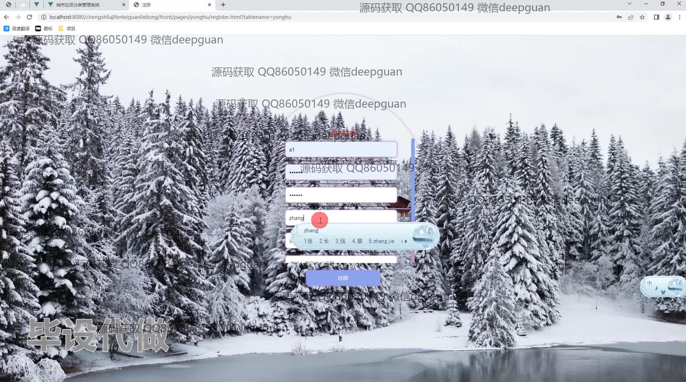

<h1 align="center">基于的城市垃圾分类管理系统</h1>

## 简介
城市垃圾分类管理系统：用户角色包括管理员和普通用户；主要功能有垃圾信息管理、用户注册与登录、留言反馈、政策查看以及分类指南，提升垃圾分类效率和用户互动参与体验。    --计算机毕业设计源码；毕设源码；java毕业设计源码

## 联系方式

<h3 align="center">获取完整代码与数据库文件 + 微信：deepguan QQ: 86050149 QQ群: 783742310</h3>

<h3 align="center">可帮忙远程部署 包运行成功！提供远程部署、修改代码、设计文档指导、代码讲解等服务！</h3>

## 功能介绍（完整见运行截图）
管理员：登录注册功能，用户管理，公告管理，垃圾管理，政策管理，留言管理，提供管理用户和退出登录的选项。界面包含垃圾信息列表展示，支持新增、修改、删除和查询操作。政策信息和公告的管理功能，帮助全局协调各项事务。  

用户：注册和登录功能，用户信息输入模块，界面包含个人信息查看与修改。留言板功能用于意见反馈和建议，支持留言和回复操作。垃圾分类信息查询，包括垃圾分类指南、投放记录和分类达标情况。政策查看和社区互动功能，提升参与感和信息透明度。

## 运行截图

本代码来源于网络,仅供学习参考使用!

